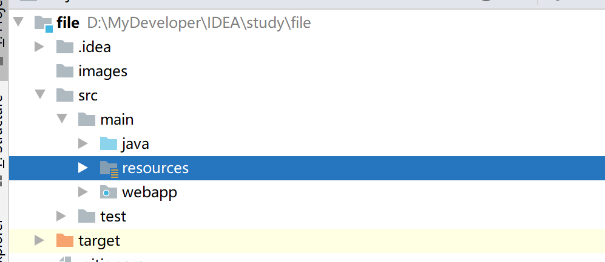

# SpringBoot实现简单的文件上传下载

[TOC]

> 本文介绍了SpringBoot实现简单的文件上传下载的实现，供各位参考


## 1、新建一个SpringBoot的项目

### 1.1、新建项目

> File-->New-->Project
>
> 选择Spring Initializr，按照提示一步一步新建一个SpringBoot项目
>
> 项目新建完成后，结构如下：



### 1.2、配置pom.xml文件

> 调整pom.xml文件的配置，将打包方式改成war包，详细内容如下：

- pom.xml

```xml
<?xml version="1.0" encoding="UTF-8"?>
<project xmlns="http://maven.apache.org/POM/4.0.0" xmlns:xsi="http://www.w3.org/2001/XMLSchema-instance"
         xsi:schemaLocation="http://maven.apache.org/POM/4.0.0 https://maven.apache.org/xsd/maven-4.0.0.xsd">
    <modelVersion>4.0.0</modelVersion>
    <groupId>com.iambest.file</groupId>
    <artifactId>file</artifactId>
    <version>0.0.1-SNAPSHOT</version>
    <name>file</name>
    <description>File Upload Download</description>
    <packaging>war</packaging>

    <properties>
        <java.version>1.8</java.version>
        <project.build.sourceEncoding>UTF-8</project.build.sourceEncoding>
        <project.reporting.outputEncoding>UTF-8</project.reporting.outputEncoding>
        <spring-boot.version>2.1.17.RELEASE</spring-boot.version>
    </properties>

    <dependencies>
        <dependency>
            <groupId>org.springframework.boot</groupId>
            <artifactId>spring-boot-starter-web</artifactId>
            <exclusions>
                <exclusion>
                    <groupId>org.springframework.boot</groupId>
                    <artifactId>spring-boot-starter-tomcat</artifactId>
                </exclusion>
            </exclusions>
        </dependency>

        <dependency>
            <groupId>org.springframework.boot</groupId>
            <artifactId>spring-boot-starter-test</artifactId>
            <scope>test</scope>
        </dependency>

        <dependency>
            <groupId>javax.servlet</groupId>
            <artifactId>javax.servlet-api</artifactId>
            <scope>provided</scope>
        </dependency>

    </dependencies>

    <dependencyManagement>
        <dependencies>
            <dependency>
                <groupId>org.springframework.boot</groupId>
                <artifactId>spring-boot-dependencies</artifactId>
                <version>${spring-boot.version}</version>
                <type>pom</type>
                <scope>import</scope>
            </dependency>
        </dependencies>
    </dependencyManagement>

    <build>
        <plugins>
            <plugin>
                <groupId>org.apache.maven.plugins</groupId>
                <artifactId>maven-compiler-plugin</artifactId>
                <version>3.8.1</version>
                <configuration>
                    <source>1.8</source>
                    <target>1.8</target>
                    <encoding>UTF-8</encoding>
                </configuration>
            </plugin>
            <plugin>
                <groupId>org.springframework.boot</groupId>
                <artifactId>spring-boot-maven-plugin</artifactId>
                <version>2.1.17.RELEASE</version>
            </plugin>
            <plugin>
                <artifactId>maven-war-plugin</artifactId>
                <version>3.0.0</version>
            </plugin>
        </plugins>
    </build>

</project>

```

## 2、写代码

### 2.1、编写FileController，实现文件上传下载

> 编写一个FileController类，用于处理文件的上传和下载请求，实现功能
>
> `uploadFile`方法用于实现文件的上传，拦截的请求路径为`/upload`
>
> `downloadFile`方法用于实现文件的下载，拦截的请求路径为`/download`，该方法接收一个请求参数`fileName`，用于指定具体需要下载的文件名称
>
> 全部代码如下：

- FileController

```java
package com.iambest.file.controller;

import org.slf4j.Logger;
import org.slf4j.LoggerFactory;
import org.springframework.beans.factory.annotation.Value;
import org.springframework.web.bind.annotation.RequestMapping;
import org.springframework.web.bind.annotation.RequestParam;
import org.springframework.web.bind.annotation.RestController;
import org.springframework.web.multipart.MultipartFile;

import javax.servlet.http.HttpServletResponse;
import java.io.*;

/**
 *
 *
 * FileController实现文件的上传和下载功能
 *
 * @author Jack_David
 * @version 1.0.0
 * @Classname FileController
 * @Date 2021/1/18 11:20
 * @Created by Jack_David
 * @since 1.0.0
 */
@RestController
public class FileController {

    @Value("${local.file.upload.path}")
    String localUploadPath;

    @Value("${local.file.download.path}")
    String localDownloadPath;

    private static final Logger logger = LoggerFactory.getLogger(FileController.class);

    /**
     * 文件上传
     * @param file file对象
     * @return 上传的结果提示
     */
    @RequestMapping("/upload")
    public String uploadFile(@RequestParam("file") MultipartFile file) {
        try {
            if (file.isEmpty()) {
                return "file is empty";
            }

            String fileName = file.getOriginalFilename();
            String suffixName = fileName.substring(fileName.lastIndexOf("."));
            logger.info("上传的文件名称为：{}，文件的后缀为：{}", fileName, suffixName);
            String localPath = this.localUploadPath;
            String fullPath = localPath + fileName;

            File localFile = new File(fullPath);

            if (!localFile.getParentFile().exists()) {
                localFile.getParentFile().mkdirs();
            }
            file.transferTo(localFile);

            return "upload success";
        } catch (IOException e) {
            e.printStackTrace();
        }

        return "upload faile";
    }

    /**
     * 根据文件名称到指定路径下面下载文件
     * @param fileName 文件的全名
     * @param response httpResponse对象
     */
    @RequestMapping("/download")
    public void downloadFile(@RequestParam("fileName") String fileName, HttpServletResponse response){
        String localFile = this.localDownloadPath + fileName;
        File file = new File(localFile);
        if(file.exists()){
            response.setContentType("application/force-download");
            response.setHeader("Content-Disposition","attachment;fileName=" + fileName);
            byte[] buffer = new byte[1024];
            FileInputStream fis = null;
            BufferedInputStream bis = null;
            try {
                fis = new FileInputStream(file);
                bis = new BufferedInputStream(fis);
                OutputStream os = response.getOutputStream();
                int i = bis.read(buffer);
                while (i != -1) {
                    os.write(buffer, 0, i);
                    i = bis.read(buffer);
                }
            }catch (IOException e) {

            }finally {
                if (bis != null) {
                    try {
                        bis.close();
                    } catch (IOException e) {
                        e.printStackTrace();
                    }
                }
                if (fis != null){
                    try {
                        fis.close();
                    } catch (IOException e) {
                        e.printStackTrace();
                    }
                }
            }
        }
    }
}
```

### 2.2、编写FileApplication

> FileApplication为应用的入口，内容如下：

- FileApplication

```java
package com.iambest.file;

import org.springframework.boot.SpringApplication;
import org.springframework.boot.autoconfigure.SpringBootApplication;
import org.springframework.boot.builder.SpringApplicationBuilder;
import org.springframework.boot.web.servlet.support.SpringBootServletInitializer;

@SpringBootApplication
public class FileApplication extends SpringBootServletInitializer {

    public static void main(String[] args) {
        SpringApplication.run(FileApplication.class, args);
    }

    @Override
    protected SpringApplicationBuilder configure(SpringApplicationBuilder builder) {
        return builder.sources(FileApplication.class);
    }

}
```

### 2.3、编写前端页面index.html

> 这里编写了一个简单的页面实现：index.html，用于文件的上传
>
> index.html路径为：resources/static/index.html
>
> 内容如下：

- index.html

```html
<!DOCTYPE html>
<html lang="en">
<head>
    <meta charset="UTF-8">
    <title>文件上传</title>
</head>
<body>
    <form action="/file/upload" method="post" enctype="multipart/form-data">
        <input type="file" name="file" id="file" ><br/><br/>
        <input type="submit" value="提交">
    </form>
</body>
</html>
```

### 2.4、配置application.properties配置文件

> 配置应用的配置文件，设置上传存储路径，下载存储路径，文件大小等
>
> 内容如下：

- application.properties

```properties
# 应用名称
spring.application.name=file
# 应用服务 WEB 访问端口
server.port=8082

# 上传文件的路径
local.file.upload.path=D:\\file\\upload\\
# 下载文件的路径
local.file.download.path=D:\\file\\download\\

# 设置文件的大小
spring.servlet.multipart.max-file-size=500MB
spring.servlet.multipart.max-request-size=500MB
```

## 3、验证

### 3.1、配置Tomcat

> 这里根据提示，一步一步配置好Tomcat，这里用的是Tomcat8版本
>
> 如下示例：


> 配置应用的context，刚才那个tomcat窗口，选择第二个选项卡Deployment，
>
> 弹出框，右侧点击加号，选择下面的那个，
>
> 将context改为file
>
> 如下示例：


### 3.2、启动Tomcat并验证

#### 3.2.1、运行Tomcat

> 点击Tomcat的运行按钮


> 控制台输出如下，表示Tomcat运行成功：


#### 3.2.2、文件上传

> 浏览器页面访问：http://localhost:9080/file/
>
> 显示如下：


> 选择文件，这里以test.txt文件为示例
>
> 点击上传，然后提示上传成功，如下图：


> 查看本地路径，如下：
>
> 表示上传成功


#### 3.2.3、文件下载

> 我们现在本地路径下放一个文件：
>
> D:\file\download
>
> 放一个bin.rar压缩文件


> 浏览器进行下载
>
> 输入地址：localhost:9080/file/download?fileName=bin.rar


> 查看本地的下载文件
>
> 如下：

